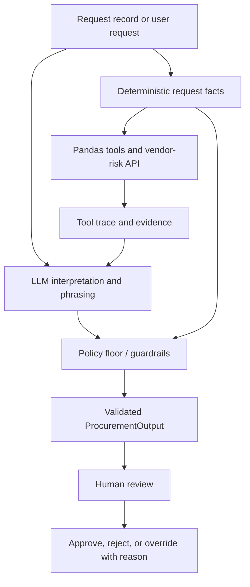

# Architecture and Workflow

## Assumptions and boundaries

- Files under `data/` are the complete synthetic snapshot; no data files are edited by the application.
- The policy reference date is `2026-09-30`, not the machine clock.
- Request facts pin tool arguments when `request_data` is supplied; model-generated values cannot weaken those facts.
- Tools are read-only and return structured evidence or explicit error envelopes.
- The model interprets and phrases evidence. `src/guardrails.py` reconciles the final model output with `src/solution.py`'s deterministic policy decision before it is shown.
- Vendor-risk outages are material uncertainty and route the request to human review.
- A human remains responsible for approval, rejection, exceptions, and override reasons.
