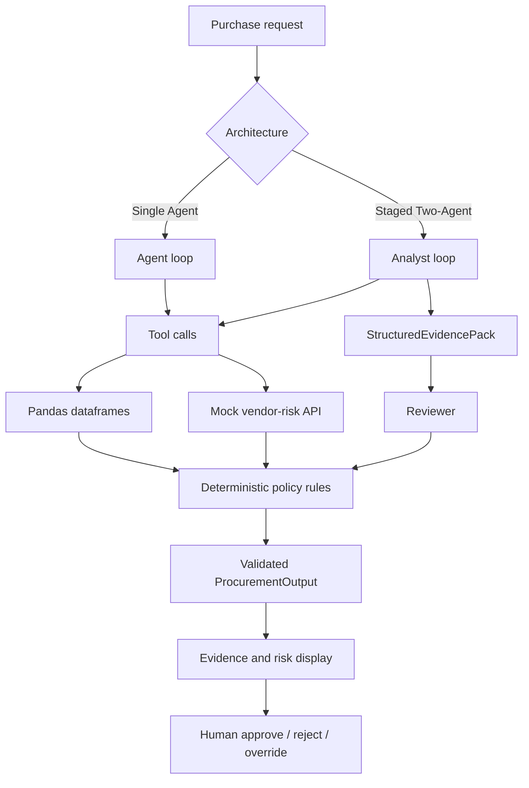

# Architecture and Workflow

## Assumptions and boundaries

- The CSV, JSON, and policy files under `data/` are the complete synthetic snapshot for the assessment.
- Date-based checks use the policy reference date `2026-09-30`, not the machine clock.
- Pandas tools are deterministic; the model proposes structured output but cannot purchase software, approve spend, change budgets, or accept legal terms.
- Vendor-risk API failures are material uncertainty. The vendor tool records unavailable evidence and falls back only to the local snapshot where possible.
- The Analyst gathers budget, catalog-overlap, and vendor-risk evidence. The Reviewer applies deterministic policy output and formats the final recommendation.
- Each pure-Python tool loop is capped at five iterations. Human review remains mandatory for approval decisions and exceptions.
